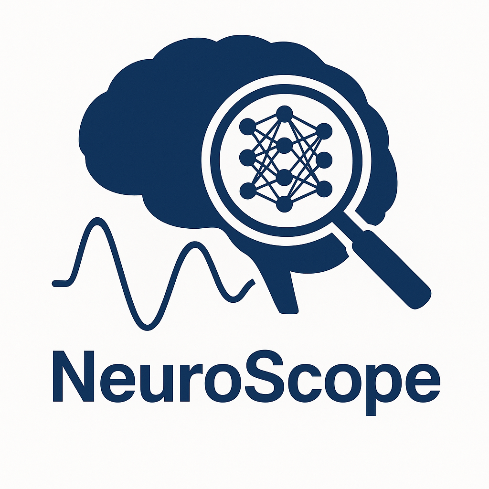

# NeuroScope



A small, modular playground for learning function approximation with neural networks—featuring:

- 1D **and** 2D inputs (with a 3D surface view in 2D mode)
- Full-batch **manual gradient descent** (no SGD/Adam)
- Live **dashboard animation**:
  - Function fit (1D curve or 3D surface)
  - Training loss + **generalization error** (outside the training range/box)
  - **Sharpness** (top Hessian eigenvalue) with the **2/η** stability threshold
  - |Δθ · vₘₐₓ| projection (parameter update onto top Hessian eigenvector)
- **Pluggable target functions** (sin, poly, RBF, custom callable)
- **Pluggable loss** (MSE/L1) + optional **L2 regularization** + **PDE residuals** (PINN-style)
- **CUDA** support if available
- Auto-managed **run directories** (`runs/<name_###>/`) with `config.json` and saved animation

---

## Quick Start

```bash
# From the project root (one level above src/ or src/ package)
python -m src.main
```

You should see logs like:

```
[INFO] Run directory: runs/run_001
[INFO] Target function: sin params={}
[INFO] Using device: cuda   # or cpu
[OK] Saved runs/run_001/animation.mp4
```

If MP4 fails due to ffmpeg, the code falls back to GIF automatically.

---

## Project Structure

```
<project_root>/
├─ src/
│  ├─ __init__.py        
│  ├─ config.py          
│  ├─ functions.py       
│  ├─ data.py            
│  ├─ model.py           
│  ├─ training.py        
│  ├─ linalg.py          
│  ├─ losses.py          
│  ├─ viz.py             
│  ├─ runio.py           
│  └─ main.py            
└─ runs/
   └─ <auto-created per run>/
       ├─ config.json
       └─ animation.mp4  (or animation.gif)
```

---

## What Each File Does

### `src/config.py`
Central **Config** dataclass for experiment settings.

### `src/functions.py`
Registry of target functions (1D and 2D).

### `src/data.py`
Samples training data, resolves functions.

### `src/model.py`
Tiny input-dim aware MLP.

### `src/training.py`
Manual gradient descent, returns loss and Δθ.

### `src/linalg.py`
Hessian utilities and power iteration.

### `src/losses.py`
Composite loss: base + L2 + PDEs.

### `src/viz.py`
2×2 live dashboard animation.

### `src/runio.py`
Run folder creation, config saving.

### `src/main.py`
Full pipeline orchestrator.

---

## Configuration Examples

### 1D sine
```python
cfg = Config(project_name=None, input_dim=1)
main(cfg)
```

### 2D function
```python
cfg = Config(project_name="2d-sincos", input_dim=2, function_name="sin_cos2d")
main(cfg)
```

### With regularization
```python
cfg = Config(criterion_name="mse", criterion_params={"l2_weight":1e-4})
main(cfg)
```

---

## Requirements

- Python 3.9+
- PyTorch
- NumPy
- Matplotlib
- tqdm
- ffmpeg (optional)

---